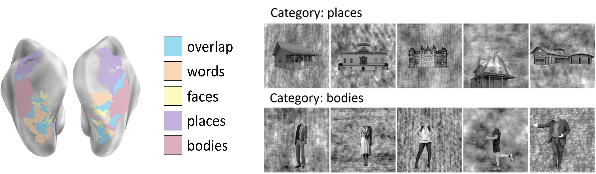
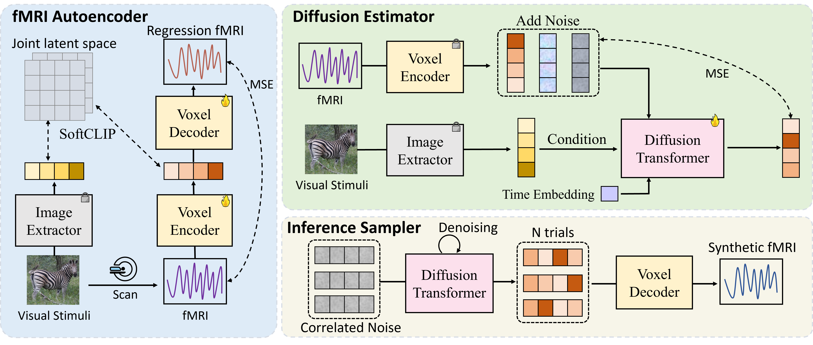
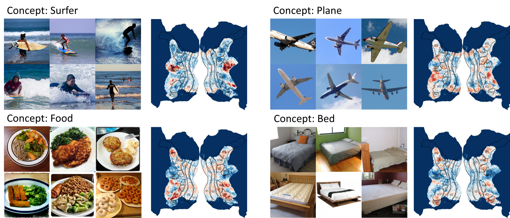

# MindSimulator

## Introduction

**Concept-selective regions** within the human cerebral cortex exhibit significant activation in response to specific visual stimuli associated with particular concepts (Left of the following figure). Precisely localizing these regions stands as a crucial long-term goal in neuroscience to grasp essential brain functions and mechanisms. Conventional experiment-driven approaches hinge on manually constructed visual stimulus collections and corresponding brain activity recordings, constraining the support and coverage of concept localization. Additionally, these stimuli (Right of the following figure) often consist of concept objects in unnatural contexts and are potentially biased by subjective preferences, thus prompting concerns about the validity and generalizability of the identified regions. 



To address these limitations, we propose a data-driven exploration approach. By synthesizing extensive brain activity recordings, we statistically localize various concept-selective regions. Our proposed **_MindSimulator_** (as following images) leverages advanced generative technologies to learn the probability distribution of brain activity conditioned on concept-oriented visual stimuli. 



This enables the creation of simulated brain recordings that reflect real neural response patterns. Using the synthetic recordings, we successfully localize several well-studied concept-selective regions and validate them against empirical findings, achieving promising prediction accuracy. We further localized the arbitrary concept-selective regions (as following images). The feasibility opens avenues for exploring novel concept-selective regions and provides prior hypotheses for future neuroscience research.




## Codes & Runs


## Acknowledgements


## Citations

```
@inproceedings{bao2025mindsimulator,
  title={MindSimulator: Exploring Brain Concept Localization via Synthetic fMRI},
  author={Bao, Guangyin and Zhang, Qi and Gong, Zixuan and Wu, Zhuojia and Miao, Duoqian},
  booktitle={The Thirteenth International Conference on Learning Representations},
  year={2025}
}
```

